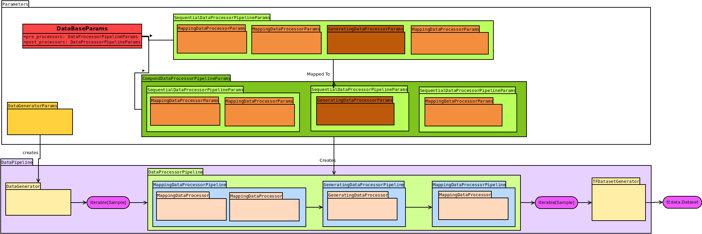
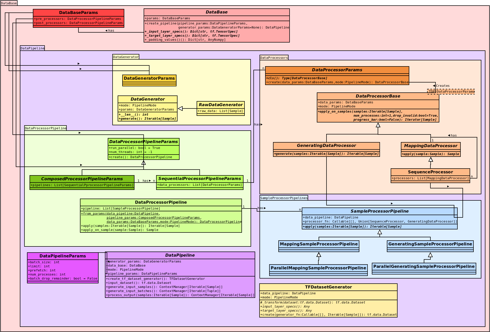

Data
====

The data class is responsible for loading (e.g., images or texts), and processing (e.g., data augmentation) of samples.
A sample is a single instance of data that is processed in the network.

A preprocessing pipeline handles the data that are fed into the :ref:`Model<doc.model:Model>` by applying a list of ``DataProcessors`` and eventually setting up a ``tf.data.dataset``.
Furthermore, a postprocessing pipeline can be added to process the data (e.g. pruning) that is produced by the network.

Figure 1 shows an overview of the pre-processing pipeline provided by |tfaip|.
The actual pipeline (lower half, purple) is created by a list of ``DataProcessorParams`` (upper half, orange).
The input of the pipeline  (``DataGeneratorParams``, golden) is can depend on the steps training, LAV, or prediction.
Usually, this is ``ListsFileDataGeneratorParams`` which will simply generate filenames parsed from text file (see `Scenario<doc.scenario:ListFileScenario>` for setting up a ``ListFileScenario``).

    Figure 1: The data processing pipeline

Implementation
--------------

A data class has to extend ``from tfaip.data.data import DataBase`` and implement the following

.. code-block:: python

    @pai_dataclass
    @dataclass
    class DataParams(DataBaseParams):
        @staticmethod
        def cls():
            return Data

    class Data(DataBase[DataParams]):
        @abstractmethod
        def _input_layer_specs(self) -> Dict[str, tf.TensorSpec]:
            raise NotImplementedError

        @abstractmethod
        def _target_layer_specs(self) -> Dict[str, tf.TensorSpec]:
            raise NotImplementedError

        @classmethod
        def default_params(cls):
            # can optionally be overwritten
            p = super().default_params()
            p.pre_proc.processors = [
                # Optionally pass a list of DataProcessorParams to define the input pipeline (see orange boxes in Figure 1)
            ]
            return p

Extend DataBaseParams to return the actual implementation in the ``cls`` method. It is recommended to do this in a separate python file (e.g. called ``params.py``).

Required Overrides
~~~~~~~~~~~~~~~~~~

The only two required methods to overwrite return dicts mapping from node names to ``tf.TensorSpec``, e.g.,

.. code-block:: python

    def _input_layer_specs(self) -> Dict[str, tf.TensorSpec]:
        # Shape and type of the input data for the graph
        return {'img': tf.TensorSpec(shape=[28, 28], dtype='float32')}

    def _target_layer_specs(self) -> Dict[str, tf.TensorSpec]:
        # Shape and type of the input data for the graph
        return {'tgt': tf.TensorSpec(shape=[1], dtype='int32')}

for a fixed 28x28 input image, and a class label as target.
The batch dimension must be omitted as batching is performed automatically.

**Important**: No scalars are allowed. Allowed shapes ``[1]`` for a scalar, ``[N]`` for vector, ``[H,W,C]`` for a tensor, ...

Optional Overrides
~~~~~~~~~~~~~~~~~~

By default, all arrays are automatically padded with zeros, overwrite ``_padding_values`` to provide different values.

.. code-block:: python

    def _padding_values(self) -> Dict[str, AnyNumpy]:
       return {'img': 255}

Pre/Post-Processing Pipelines
-----------------------------

``DataProcessors`` enable to modify data by consuming and producing a list of ``Sample``.
There are two types of data processors:

* A ``MappingDataProcessor`` is similar to the default mapping function of Python and produces one output sample for each input sample (a ``1`` to ``1`` mapping).
* A ``GeneratingDataProcessor`` is similar to a generator in Python: ``N`` samples are consumed but ``M`` samples are produces, whereby ``M<N`` and ``M>N`` are equally legitimated.

``DataProcessors`` are defined and constructed by their corresponding ``DataProcessorParams``.

DataProcessor Definition
~~~~~~~~~~~~~~~~~~~~~~~~

The following shows a simple ``DataProcessor`` that will load an image and its GT from the drive based on filenames.
Optionally, add parameters (e.g., the color mode in this case) to the processor params.

.. code-block:: python

    @pai_dataclass
    @dataclass
    class LoadSampleProcessorParams(DataProcessorParams):
        def cls(self):
            return LoadSampleProcessor

    class LoadSampleProcessor(MappingDataProcessor):
        def apply(self, sample):
            return (
                sample.
                    new_inputs(load_image(sample.inputs)).   # Change the inputs
                    new_targets(load_gt(sample.targets))     # Change the targets
            )

Set Up
~~~~~~

Override the ``default_params`` of the ``Data``-class to set up the default preprocessing pipeline:

.. code-block:: python

    @classmethod
    def default_params(cls) -> ListFileDataParams:
        # setup default processing pipeline
        params = super().default_params()
        params.pre_proc = SequentialDataProcessorPipeline(
            run_parallel=True,  # Set to True if this pipeline shall run in parallel
            processors=[
                LoadSampleProcessorParams(),  # Load the sample and its GT
                AugmentProcessorParams(modes={PipelineMode.Training}),  # Apply data augmentation, but only during training
                FinalizeProcessorParams(),  # Finalize the sample, i.e., bring it in the correct form matchin the input and target layer specs
            ],
        )
        return params

Modes of DataProcessor
""""""""""""""""""""""

As shown in the previous code, the ``DataProcessorParams`` provide a field when to apply this processor.
Here, the ``AugmentProcessorParams`` (i.e., data augmentation) shall only be applied on the training pipeline.

Resources
---------

Quite often your model requires resources for training but also for the later application.
A typical resource is a file that needs to be served when exporting the model.
The dataclass automatically handles the export of ``Resources`` via its ``ResourceManager`` by copying the resources to the export dirs and automatically adapting the search path of the resource.
Define a ``Resource`` in your parameters:

.. code-block:: python

    @pai_dataclass
    @dataclass
    class DataParams(DataBaseParams):
        charmap: Resource = field(default=None,
                                  metadata={**pai_meta(help="File specifying the character map used", required=True),
                                            **config(encoder=Resource.encode, decoder=Resource.decode)}
                                  )

In this example, the character map will automatically be copied to the ``resources`` dir in the exported model.

Development
-----------

This section provides additional information about the actual implementation of the data pipeline in |tfaip|.
Read this if you are interested in understanding or extending |tfaip|.

The following image provides an overview of all relevant classes

    Figure 2: Overview of all classes withing the data module

Have a look at the code documentation for a description of the individual classes, in the following is only a small overview:

* Red: ``DataBaseParams`` and ``DataBase`` define the overall structure of a data pipeline by connecting ``DataProcessorParams``.
  By calling ``get_or_create_pipeline``, or ``create_pipeline`` a ``DataPipeline`` will be prepared.
* Purple: Entering this pipeline ``with DataPipeline as RunningDataPipeline`` a ``RunningDataPipeline`` will be created which will spawn threads if required and join them when exiting the ``with`` block.
* Yellow: The ``DataGenerator`` provide the data for the preprocessing pipeline. The actual implementation depends on the scenario and mode (e.g. different data sources for training, lav and prediction)
* Orange: The creation and definition of the different ``DataProcessor`` types. A user should only override ``MappingDataProcessor`` and ``GeneratingDataProcessor``. Multiple ``MappingDataProcessors`` will be joined to a ``SequenceProcessor`` for faster execution (send as a complete block to a spawned process upon parallelization).
* Green: Setting up of the actual Pipeline using parameters. By default, a ``SequenceProcessorPipelineParams`` should suffice, if however `GeneratingDataProcessors` play a role it might be sensible to provide a custom grouping which can be done via ``CompoundProcessorPipelineParams``
  Note, the ``SequenceProcessorPipelineParams`` will be converted automatically to a ``CompoundProcessorPipelineParams`` (see Figure 1).
* Blue: These classes are use for the actual data processing of a set of ``MappingDataProcessors`` in a ``MappingSampleProcessorPipeline`` or one ``GeneratingDataProcessor`` in a ``GeneratingSampleProcessorPipeline``.
  Each class has a corresponding parallel version (see lower half of Figure 1).
  Construction of the actual processors (calling ``DataProcessorParams.create``) is performed within these classes to ensure that only the parameters are passed to a spawned process not the actual class (which might not be serializable via pickle).
* Yellow (lower left): The ``TFDatasetGenerator`` can optionally be overwritten in a DataPipeline to change the creation of the ``tf.data.Dataset`` or to inject additional data mappings performed in Tensorflow.

