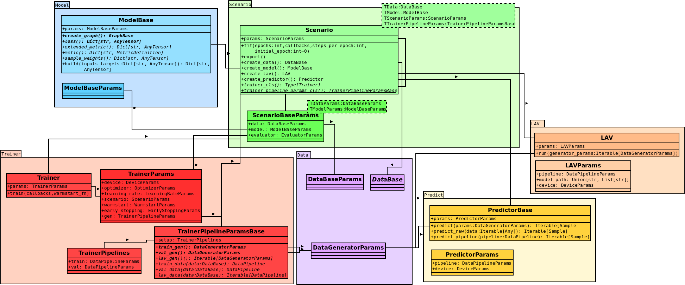

Scenario
========

A scenario is the container for implementing a custom task that shall be solved by |tfaip|.
The scenario glues together all components that must and can be implemented, see Figure 1.

    Figure 1: Scenario Overview

The ``ScenarioBase`` (green) creates the :ref:`Model<doc.model:model>` (blue) and :ref:`Data<doc.data:data>` (purple).
:ref:`Training<doc.training:Training>` (red), :ref:`Load And Validate<doc.evaluation:Load and Validate (LAV)>` (LAV, orange), and :ref:`Prediction<doc.prediction:Prediction>` (yellow) access the scenario but are also instantiated by the ``ScenarioBase`` to allow to implement custom overrides.

Scenario Directory
------------------

Each scenario should be set up in a directory that comprises the following files:
* ``scenario.py`` which defines the basic scenario information
* ``model.py`` which defines the :ref:`model<doc.model:model>` (neural net)
* ``data.py`` which defines the input :ref:`data<doc.data:data>` pipeline of the model
* ``graphs.py`` which defines the :ref:`graph(s)<doc.graph:graph>` of the model
* ``params.py`` (optional but recommended) which stores the parameters of data, model, and the scenario. (Note, the data params, if implemented should always be implemented in a different file than data itself else there will occurr warnings in the data pipeline).

If ``tfaip`` was set up by cloning the repository, the scenario class should be located at ``tfaip/scenario/XXX/scenario.py`` where ``XXX`` is the scenario name, e.g. ``atr``.
If :ref:`installed<doc.installation:installation>` via ``pypi`` (i.e., ``pip install tfaip``), an arbitrary directory can be used for the location of a scenario.

Implementing a Scenario
-----------------------

To implement a ``ScenarioBase``, first :ref:`setup a directory and the files<doc.scenario:scenario directory>`. In ``scenario.py`` (or ``params.py``) implement ``MyScenarioParams``:

.. code-block:: python

    @pai_dataclass
    @dataclass
    class MyScenarioParams(ScenarioBaseParams[MyDataParams, MyModelParams]):
        pass

The ``MyDataParams`` and ``MyModelParams`` implement ``DataBaseParams`` and ``ModelBaseParams`` to define the parameters for the data and the model.

Next, implement the actual scenario:

.. code-block:: python

    class MyScenario(ScenarioBase[MyScenarioParams, MyTrainerPipelineParams]):
        pass

The ``MyTrainerPipelineParams`` define how the input data source for training and extend either ``TrainerPipelineParamsBase`` or ``TrainerPipelineParams``.
The derived ``ListFileScenario`` already implements the ``TrainerPipelineParams`` by assuming a list file as input (see :ref:`here<doc.scenario:listfilescenario>`).

Development
-----------

The ``Scenario`` defines several ``Generics`` that are used for instantiation of the actual classes of ``TModel``, ``TData``, ``TScenarioParams``, and the ``TTrainerPipelineParams``.
The ``ListFileScenario`` replaces ``TTrainerPipelineParams`` by ``ListFileTrainerPipelineParams``.

Additional Modules
------------------

In the following, additional methods/functionality of a scenario that can optionally be implemented is listed.

Evaluator
~~~~~~~~~

Quite often, defining metrics is difficult in pure Tensorflow-Operations while it is trivial using python and numpy.
Furthermore, some metrics should also first be computed after [post-processing](04_data.md)
For this purpose, |tfaip| offers the ``Evaluator`` which is similar to a ``keras.Metric`` however with the advantage that anything can be computed with most flexibility.
An ``Evaluator`` can optionally be parametrized by ``EvaluatorParams``.

Similar to a ``keras.Metric`` the ``Evaluator`` requires to overwrite two functions, namely ``update_state`` and ``result``.
``update_state`` receives a post-processed (un-batched) Sample and should update an internal state.
Finally, ``result`` shall yield a dictionary of the metrics.

The ``Evaluator`` follows the ``context``-design of Python: A metric is ``__enter__``-ed before the validation, and ``__exit__``-ed after receiving the result.
Use this mechanism to clear the internal state.

The ``Evaluator`` is attached to a ``Scenario`` using the ``evaluator_cls``-method.

Example
"""""""
The full tutorial provides an example:

.. code-block:: python

    class MNISTEvaluator(Evaluator):
        def __init__(self, params):
            super(MNISTEvaluator, self).__init__(params)
            self.true_count = 0
            self.total_count = 0

        def __enter__(self):
            self.true_count = 0
            self.total_count = 0

        def update_state(self, sample: Sample):
            self.total_count += 1
            self.true_count += np.sum(sample.targets['gt'] == sample.outputs['class'])

        def result(self) -> Dict[str, AnyNumpy]:
            return {'eval_acc': self.true_count / self.total_count}

Add this in the ``Scenario``:

.. code-block:: python

    @classmethod
    def evaluator_cls(cls):
        return MNISTEvaluator

Tensorboard
"""""""""""

During training, the computed metrics by ``result`` will be written to the Tensorboard.
This also allows computing custom data (e.g., images or PR-curves) within the ``Evaluator``.
The :ref:`model<doc.model:tensorboard>` defines how to write arbitrary data to the Tensorboard.

ListFileScenario
----------------
The ``ListFileScenario`` is an abstract ``ScenarioBase`` that already provides some additional functionality if using list files as the input source.
A list file is a simple text file where each line is the path to a sample, e.g. an image:

.. code-block::

    path/to/image_001.png
    path/to/image_002.png
    path/to/image_003.png
    ...

The following shows how to extend a ``ListFileScenario``:
Assume the new scenario has the model ``Model`` and corresponding params ``ModelParams``, ``Data`` and corresponding ``DataParams``, and works with list files.
The new scenario, here called ``Scenario`` requires to set up its params the corresponding implementation.
Note, that both classes are empty since in most cases no extra functionality is required.

.. code-block:: python

    @pai_dataclass
    @dataclass
    class ScenarioParams(ScenarioBaseParams[DataParams, ModelParams]):
        pass

    class Scenario(ListFileScenario(ScenarioParams)):
        pass
